### **KaliVM Network Attacks**  

---

# **Section 1: Conceptual Assignments**  

### **1. ARP Poisoning & Advanced MITM Techniques**
**Advanced Techniques to Bypass ARP Defenses**
Traditional **ARP poisoning** exploits the Address Resolution Protocol (ARP) to associate an attacker’s MAC address with a legitimate IP address, enabling them to intercept, modify, or redirect network traffic. However, attackers can bypass common ARP defenses through various techniques:

- **Static ARP Tables**: Static ARP entries can prevent attackers from poisoning the ARP table. However, attackers can exploit **physical security weaknesses** to gain access to devices and manually alter or remove these static entries. Additionally, if attackers have administrative privileges, they can change the ARP configuration, effectively bypassing static ARP defenses.
  
- **Dynamic ARP Inspection (DAI)**: DAI verifies ARP packets against a trusted database. While this is an effective defense, attackers can bypass it by exploiting **misconfigurations**. For example, improperly configured DAI or a lack of support for DAI across the network allows attackers to craft ARP packets that appear legitimate, tricking the system into accepting malicious ARP messages. **Man-in-the-middle (MITM)** attacks can still succeed if devices trust invalid ARP replies.

**Proxy ARP Manipulation and Expanding Control**

**Proxy ARP** is a technique where a router or network device responds to ARP requests on behalf of another device. Attackers can exploit Proxy ARP by configuring their device to respond to ARP requests for IP addresses they do not own, causing traffic to flow through the attacker’s device. This gives the attacker the ability to:
- **Intercept traffic**: The attacker becomes an intermediary for network traffic, allowing them to observe, manipulate, or redirect it.
- **Expand attack surface**: Proxy ARP increases the range of traffic the attacker can control, even when devices do not directly send traffic to the attacker’s device. This is particularly dangerous in network environments where devices expect to communicate with other legitimate devices but are unknowingly routed through an attacker.

**Executing ARP-based MITM in VLAN-Segmented Networks**

Even in **VLAN-segmented networks**, ARP poisoning attacks remain feasible. VLANs segment broadcast traffic, but ARP operates at the data link layer (Layer 2), which means if an attacker is within the same VLAN, they can still manipulate ARP traffic. Additionally, attackers may exploit **VLAN hopping** techniques, such as **double tagging**, to escalate their attack and send ARP poisoning packets to multiple VLANs. This technique can be used to:
- **Bypass VLAN isolation**: By manipulating VLAN tags, the attacker can cause ARP requests to reach devices outside their VLAN, enabling cross-VLAN ARP poisoning.
- **Compromise multiple devices**: With a properly configured attack, the attacker can poison ARP caches across multiple VLANs, facilitating broader MITM attacks within a segmented network.

**Real-World Example: ARP Poisoning and MITM Attacks**

In 2014, the **Korean Bank Heist** (also known as the “ATM Hacking Incident”) highlighted the effectiveness of ARP poisoning in bypassing network defenses. Attackers exploited vulnerabilities in the bank’s network, using ARP poisoning to intercept communication between ATM machines and the bank's backend servers. By using this method, attackers were able to steal customers’ PIN codes and account details, resulting in financial theft.

**Mitigation Strategies**

To prevent ARP poisoning and associated MITM attacks:
- **Static ARP entries** should be used for critical network infrastructure, though they need to be carefully managed.
- **Dynamic ARP Inspection (DAI)** must be configured across all network devices to validate ARP packets.
- **Port security** and **network monitoring** should be implemented to detect unusual ARP traffic patterns.
- **VLAN segmentation** should be supplemented with strong authentication mechanisms like **802.1X** to ensure devices can only communicate within authorized VLANs.

**Conclusion**

ARP poisoning and advanced MITM techniques, such as Proxy ARP manipulation, pose significant threats to network security, even in segmented VLAN environments. A multi-layered defense strategy combining proper ARP security, network monitoring, and access control is crucial to protecting against these attacks. 

---

### **2. ARP Spoofing in IPv6 Networks**  
**Executing a MITM Attack in IPv6: NDP Spoofing**

In IPv6, **ARP poisoning** is replaced by **Neighbor Discovery Protocol (NDP)**, which is used for discovering devices on the local network and resolving IPv6 addresses to link-layer addresses (MAC addresses). NDP uses **ICMPv6** messages like Neighbor Solicitation (NS) and Neighbor Advertisement (NA) to perform its tasks. Attackers can execute a **Man-in-the-Middle (MITM)** attack in IPv6 using a technique called **NDP Spoofing**. This is similar to ARP Spoofing in IPv4.

NDP Spoofing involves:
- **Sending fraudulent Neighbor Advertisement (NA) messages**: The attacker sends fake NA messages that claim to have the link-layer address (MAC) associated with a legitimate device’s IPv6 address. This misleads the target device into associating the attacker’s MAC address with the victim’s IPv6 address.
- **Redirecting traffic**: Once the target device believes the attacker’s MAC address is the legitimate one, the attacker can intercept, modify, or redirect traffic meant for the victim, effectively executing a MITM attack.

Similar to ARP poisoning in IPv4, NDP Spoofing allows attackers to capture sensitive information, perform data manipulation, and potentially execute more sophisticated attacks like session hijacking.

**Comparison of NDP Spoofing vs. ARP Poisoning**

**Difficulty**:
- **ARP Poisoning**: ARP spoofing in IPv4 is a well-known attack that is straightforward to execute. Tools like **Ettercap** and **Cain & Abel** make ARP poisoning easy for attackers, as the protocol has no built-in authentication.
- **NDP Spoofing**: NDP Spoofing in IPv6 is conceptually similar to ARP Poisoning but is slightly more complex. While tools for NDP spoofing exist (such as **ndp7** or **mitm6**), it requires familiarity with IPv6 and ICMPv6 messages, making it slightly more challenging than ARP spoofing. However, the attack is still easy to execute if the attacker has the right tools and knowledge.

**Effectiveness**:
- **ARP Poisoning**: ARP poisoning is highly effective in IPv4 networks since ARP is an inherently insecure protocol. ARP cache poisoning can affect all devices on the same subnet, causing widespread disruptions or facilitating MITM attacks.
- **NDP Spoofing**: NDP Spoofing in IPv6 can be just as effective as ARP poisoning. The major difference is that IPv6 was designed to handle a much larger address space, which can make attacks harder to scale. However, NDP is still prone to the same vulnerabilities, such as the lack of authentication in the Neighbor Advertisement (NA) process, allowing attackers to spoof messages.

**Real-World Example: NDP Spoofing in IPv6**

In 2013, researchers demonstrated that **NDP Spoofing** could be exploited in IPv6 networks to compromise devices. In their demonstration, attackers used NDP Spoofing to redirect traffic within an IPv6 network and intercept sensitive communications. This attack works similarly to ARP Poisoning, allowing attackers to gain unauthorized access to network traffic, even in modern IPv6 environments.

**Mitigation Strategies**

To defend against NDP Spoofing and ARP Poisoning, the following strategies can be implemented:
- **Secure Neighbor Discovery (SEND)**: A security extension for NDP that provides cryptographic protection to prevent NDP Spoofing by verifying the authenticity of Neighbor Advertisement messages.
- **RA Guard**: Implements filters on routers to block unauthorized Router Advertisement (RA) messages, preventing attackers from sending false RAs.
- **Static IP-to-MAC mappings**: Similar to static ARP entries, statically mapping IP addresses to MAC addresses can prevent unauthorized devices from responding to NDP requests.
- **Intrusion Detection Systems (IDS)**: IDS can help detect abnormal traffic patterns associated with NDP Spoofing, such as multiple devices claiming the same IP address.

**Conclusion**

Both **NDP Spoofing** in IPv6 and **ARP Poisoning** in IPv4 present significant risks for network security. While IPv6 introduces some new complexities, it does not inherently solve the issue of insecure address resolution. The attack vectors remain largely the same, and the necessary defenses, such as Secure Neighbor Discovery (SEND) and RA Guard, are crucial to maintaining a secure network environment.

---

### **3. DHCP Starvation & Rogue DHCP for Long-Term Persistence**  
**Why is DHCP Starvation an Effective Denial-of-Service Attack?**

**DHCP Starvation** is a **Denial-of-Service (DoS)** attack in which an attacker floods a DHCP server with a large number of requests, each with a different **fake MAC address**. This causes the server’s DHCP pool to be exhausted, preventing legitimate devices from obtaining an IP address and causing widespread network disruption. 

The attack is effective because:
- **Exhaustion of IP Pool**: DHCP servers assign IP addresses dynamically, and once the pool is depleted, no further IP addresses are available for legitimate devices.
- **Simplicity**: The attack is easy to execute using readily available tools like **DHCP starvation tools**.
- **Immediate Impact**: Devices that rely on DHCP for IP addressing cannot access the network, causing immediate service disruption.

**Using a Rogue DHCP Server for MITM and Long-Term Persistence**

An attacker can use a **rogue DHCP server** for more than just a **Man-in-the-Middle (MITM)** attack. By setting up a rogue DHCP server that provides malicious IP configurations, the attacker can:

1. **MITM Attacks**: The rogue server can assign a **malicious gateway or DNS server**, redirecting traffic through the attacker's device. This allows the attacker to intercept or manipulate traffic, steal sensitive data, or inject malicious content.
  
2. **Long-Term Persistence**:
   - **Static IP Assignment**: The rogue server can configure devices with long lease times, ensuring devices continue to use the malicious server over an extended period.
   - **Hidden Access**: The attacker could configure the rogue DHCP server to give the attacker’s device as the **default gateway**, maintaining access to network traffic without being detected. This stealthy foothold allows the attacker to intercept traffic continuously, even after the attack has been executed.
   - **DNS Manipulation**: The attacker can direct devices to **malicious DNS servers** that resolve domains to fake IP addresses, enabling long-term control over victim’s web traffic.

**Defense-in-Depth: Combating Rogue DHCP Attacks**

A **defense-in-depth** strategy, combining **DHCP snooping**, **802.1X authentication**, and **VLAN segmentation**, can significantly mitigate the risks of rogue DHCP attacks:

- **DHCP Snooping**: This security feature allows the network to **trust only specific ports** for DHCP replies, preventing unauthorized devices from acting as DHCP servers. By ensuring that only designated ports on trusted network devices (like routers) can issue DHCP leases, rogue DHCP servers are blocked from participating in the network.
  
- **802.1X Authentication**: **802.1X** is an **IEEE standard** for **port-based network access control**. It ensures that only authenticated devices can connect to the network. By requiring devices to authenticate using credentials before gaining network access, the attacker cannot simply plug into any port and set up a rogue DHCP server. This adds a layer of security by verifying devices before they are granted access.
  
- **VLAN Segmentation**: **VLAN segmentation** helps isolate different parts of the network, limiting the scope of the attack. If an attacker compromises one segment, the impact is contained to that VLAN. Additionally, network traffic between VLANs can be tightly controlled using **Layer 3 routers** or **firewalls**, preventing the spread of rogue DHCP attacks across multiple segments. Properly segmenting the network also reduces the attack surface.

**Real-World Example: Rogue DHCP Attack**
In 2013, attackers used a rogue DHCP server in a **corporate network** to perform a MITM attack. By configuring a device with a rogue DHCP server, the attackers were able to assign their own device as the default gateway. This allowed them to intercept and modify network traffic, stealing sensitive employee credentials. The attack went undetected for months, as the attacker’s device remained in the middle of communications without being noticed.

**Mitigation Strategies**
To defend against DHCP starvation and rogue DHCP attacks:
- **DHCP Snooping** should be enabled on all network switches to ensure only legitimate DHCP servers can provide IP addresses.
- **802.1X Authentication** should be deployed to ensure that only authenticated devices are granted network access.
- **VLAN Segmentation** should be used to contain rogue DHCP attacks within a specific network segment, limiting their scope and impact.

**Conclusion**
Combining **DHCP snooping**, **802.1X authentication**, and **VLAN segmentation** provides a robust defense against rogue DHCP attacks and DHCP starvation. By preventing unauthorized DHCP servers, controlling device access, and limiting the spread of attacks within segmented networks, these defenses significantly reduce the risk of MITM attacks and long-term network persistence by attackers.

---

### **4. VLAN Hopping & Subverting Network Segmentation**  
**Bypassing VLAN-Based Segmentation Beyond Double Tagging and Switch Spoofing**

VLAN-based segmentation is a common method used to isolate and protect network traffic. However, attackers can still find ways to bypass VLAN segmentation through several techniques beyond the well-known **double tagging** and **switch spoofing** methods:

1. **MAC Flooding**: Attackers can use **MAC flooding** tools to overload a switch’s **MAC address table** (also called a forwarding table). By flooding the switch with fake MAC addresses, the switch is forced to enter **fail-open mode**, where it forwards packets to all ports, effectively disabling VLAN isolation. This allows the attacker to sniff traffic or intercept communications from other VLANs.

2. **VLAN Misconfiguration**: Misconfigured **VLAN assignments** on switches can allow attackers to gain unauthorized access to a VLAN. If a switch is configured to allow VLAN traffic to be improperly forwarded or assigned, an attacker can manipulate VLAN settings to gain access to network segments they should not be able to reach. This could happen through poor **default VLAN configurations** or incorrect port VLAN membership assignments.

3. **Layer 3 Protocol Exploits**: Attackers can exploit **Layer 3 routing** misconfigurations or vulnerabilities to bypass VLAN segmentation. For example, attackers could gain access to **routing devices** or exploit vulnerabilities in **inter-VLAN routing** to bypass the VLAN separation. Properly secured routing protocols are essential to prevent this type of attack.

**Abusing VLAN Misconfigurations by Insider Threats**

Insider threats, where an attacker has some level of internal access to the network, can exploit **VLAN misconfigurations** to escalate privileges within a corporate network:

1. **VLAN Assignment Manipulation**: An insider could change VLAN configurations on their own machine or on switches they have access to. For example, by accessing switch configuration interfaces, an insider can reassign their port to a more privileged VLAN, gaining access to sensitive resources or administrative interfaces.

2. **Privilege Escalation Through Administrative Access**: If an insider can manipulate VLAN settings, they can potentially escalate their access to high-security segments such as the **management VLAN** or VLANs containing sensitive data (e.g., HR, finance). They may also bypass network segmentation, allowing them to interact with servers, network appliances, and databases that should be isolated.

3. **VLAN Hopping from Internal Resources**: Insiders can also attempt to exploit **VLAN hopping** attacks from within a corporate network if segmentation is not properly enforced. By taking advantage of misconfigured switches, insiders could attempt to send double-tagged frames or use tools to spoof traffic between VLANs.

**Exploiting Dynamic VLAN Assignment via RADIUS Authentication**

Enterprises that use **Dynamic VLAN Assignment** via **RADIUS (Remote Authentication Dial-In User Service)** to assign users to specific VLANs can be vulnerable to exploitation. If an attacker can compromise the **RADIUS server** or the authentication process, they may gain unauthorized access to a VLAN. Here's how they could exploit this process:

1. **RADIUS Server Compromise**: If an attacker gains access to the **RADIUS server**, they could manipulate the **VLAN assignment rules** or inject their own authentication credentials. This would allow the attacker to gain access to a more privileged VLAN than they are entitled to.

2. **Man-in-the-Middle Attacks**: If RADIUS communications are not secured (e.g., using **SSL/TLS** for RADIUS traffic), an attacker could intercept and alter the **authentication packets**. By intercepting the RADIUS authentication process, the attacker could redirect their own user credentials to be assigned to a privileged VLAN, effectively bypassing network security measures.

3. **Rogue RADIUS Server**: An attacker could set up a **rogue RADIUS server** that masquerades as the legitimate one. When devices attempt to authenticate, they could be assigned to a different, malicious VLAN controlled by the attacker. This rogue server could redirect network traffic or grant access to unauthorized areas of the network.

**Real-World Example: VLAN Hopping and Misconfigurations**

A real-world incident occurred in 2016, when an attacker was able to gain unauthorized access to a **corporate network** by exploiting VLAN misconfigurations. The attacker, an insider with limited access, was able to manipulate VLAN assignments on the network switches to escalate their privileges and gain access to sensitive segments. This attack, combined with poor VLAN segmentation and weak internal controls, resulted in a **data breach** that compromised several critical systems.

**Mitigation Strategies**

To defend against these types of attacks:
- **Proper VLAN configuration**: Ensure that VLAN configurations are carefully reviewed and enforced on all switches. **Access control lists (ACLs)** should be used to restrict traffic between VLANs.
- **MAC address filtering**: Implement **MAC filtering** to limit which devices can access each VLAN, reducing the risk of **MAC flooding** attacks.
- **RADIUS Security**: Ensure that **RADIUS servers** are properly secured using strong authentication, encryption (SSL/TLS), and appropriate access controls. **Multifactor authentication** (MFA) can be added to RADIUS for additional security.
- **Monitor VLAN Traffic**: Use **network monitoring tools** to detect unusual VLAN traffic patterns, such as rogue devices attempting to send frames across VLANs or unauthorized VLAN changes.
- **Segment Critical Resources**: Use **firewalls** or **Layer 3 routers** to enforce stricter controls between VLANs, ensuring that sensitive resources are isolated and protected.

**Conclusion**

VLAN hopping and misconfigurations present significant security risks, particularly when attackers exploit weaknesses such as poor VLAN design or compromised authentication processes. A multi-layered defense approach, including proper VLAN configuration, strong RADIUS security, and network monitoring, is essential to mitigate these risks and maintain effective network segmentation.

---

### **5. Wireless Attacks: Rogue AP vs. Evil Twin**  
**How MAC Filtering and SSID Hiding Can Be Bypassed**
- **MAC Filtering**: MAC address filtering allows network administrators to specify which devices can connect to the network by their physical MAC address. However, attackers can easily **spoof** a legitimate MAC address to gain access. Tools like **macchanger** enable attackers to mimic the MAC address of authorized devices, bypassing this defense. 
  - **Example**: In public spaces, attackers often spoof the MAC address of a nearby device to access a protected Wi-Fi network.
  
- **SSID Hiding**: Hiding an SSID (Service Set Identifier) is another common technique to reduce exposure. However, it does not offer true security since the SSID is still broadcast in probe requests or can be discovered by network sniffers. Attackers can use tools like **Kismet** or **Wireshark** to detect hidden networks.
  - **Countermeasure**: Instead of hiding SSIDs, consider using stronger encryption methods, such as WPA3, to protect against unauthorized access.

**Deauthentication Attacks Combined with Rogue AP Techniques for Full Session Hijacking**
- A **deauthentication attack** disconnects a legitimate user from a Wi-Fi network. Once disconnected, an attacker can set up a **rogue AP** (access point) with the same SSID as the victim's original network. This tactic **tricks the victim into reconnecting** to the rogue AP, giving the attacker control over the session.
  - **Example**: In **Evil Twin** attacks, attackers can capture sensitive data like login credentials when users unknowingly connect to their rogue AP.
  - **Security Improvement**: Implement **802.1X authentication** with **EAP-TLS** (Extensible Authentication Protocol), which requires certificates, to prevent unauthorized devices from connecting.

**WPA3 Dragonfly Handshake: Mitigating Offline Dictionary Attacks**
- **WPA3** introduces the **Dragonfly handshake (Simultaneous Authentication of Equals - SAE)**, which protects against offline dictionary attacks seen in **WPA2**. In WPA2, attackers can capture a handshake and attempt to guess the password offline, allowing brute-force attacks. In contrast, WPA3's SAE makes this process much more difficult because it uses a **cryptographic protocol** that ensures a secure exchange between devices, preventing offline cracking of passwords.
  - **Real-World Example**: In WPA2, attacks like the **KRACK attack** (Key Reinstallation Attack) allowed attackers to exploit the protocol, but WPA3 offers enhanced resilience against such vulnerabilities.
  - **Countermeasure**: Implement WPA3 where possible, and for WPA2, consider using **stronger passwords** and **key management protocols**.

---

### **6. IP Spoofing in Multi-Stage Attacks**  
**How IP Spoofing Facilitates Session Hijacking and Its Effectiveness in UDP
- **IP Spoofing** allows attackers to impersonate a trusted device in a communication, enabling **session hijacking**. This is more effective in **UDP-based communications** due to UDP’s **lack of authentication**. In **UDP**, there is no session verification, which makes it easier for attackers to inject malicious packets or take over sessions.
  - **Example**: Attackers can spoof the source IP of a **DNS server** and send malicious responses to DNS resolvers, poisoning their cache.
  
- In **TCP**, while the session is protected by sequence numbers, attacks are still possible by exploiting **predictable sequence numbers**, **timing vulnerabilities**, or leveraging **man-in-the-middle** (MitM) attacks.
  - **Security Improvement**: Use **SSL/TLS** for encrypting UDP communications, even though TCP inherently supports security. Implement **stronger sequence number randomization** and **encrypted communications** in TCP to protect against session hijacking.

**Full TCP Session Hijacking Despite Sequence Number Randomization
- Even though **TCP** has improved **sequence number randomization**, full **session hijacking** remains possible. This is due to potential **implementation flaws** in randomization or attacks that exploit **predictable patterns** in sequence numbers.
  - **Example**: The **SYN flooding** attack exploits weaknesses in TCP’s connection setup process, where attackers overwhelm a system with **half-open** connections.
  - **Security Improvement**: Use **stateful firewalls** to block incomplete connections and **secure randomization algorithms** to generate unpredictable sequence numbers.

---

### **7. DNS Cache Poisoning: Evolution of Attacks**  
**Pre-Kaminsky vs. Kaminsky-Style DNS Poisoning**
- **Pre-Kaminsky Attacks**: Early attacks relied on guessing the **transaction ID** of a DNS request. Attackers would flood a DNS resolver with responses, hoping to guess the correct transaction ID and inject a malicious entry.
  
- **Kaminsky-Style Attacks**: Kaminsky demonstrated how **predictable transaction IDs** in DNS resolvers could be exploited by flooding the resolver with requests and responses, allowing attackers to poison the resolver’s cache and redirect users to malicious sites.
  - **Real-World Example**: The attack impacted large websites like **Google** and **Yahoo**, redirecting users to fraudulent sites and demonstrating the widespread vulnerability of DNS.
  
**Mitigating Kaminsky's Attack: Randomized Query IDs and Source Port Randomization**
- **Randomized Query IDs** and **source port randomization** make it harder for attackers to guess valid query IDs and source ports, thus preventing DNS cache poisoning.
  - **Security Improvement**: Ensure that all DNS resolvers use both query ID and source port randomization. Furthermore, implement **DNSSEC** for cryptographic signing of DNS data.

**DNSSEC Adoption Challenges**
- Despite DNSSEC's promise of providing **data integrity** through cryptographic signatures, its **adoption** has been slow due to the operational complexity of key management, backward compatibility with legacy systems, and lack of perceived immediate benefits.
  - **Example**: Many **internet service providers** and smaller organizations do not support DNSSEC due to implementation and operational overhead.
  - **Security Improvement**: Promote the **standardization** of DNSSEC adoption, and simplify key management through **automated tools**.

---

### **8. BGP Hijacking: Attackers as Network Operators**  
**BGP’s Lack of Authentication**
- **BGP (Border Gateway Protocol)** is the fundamental routing protocol for the internet, but it lacks **authentication** mechanisms, making it vulnerable to **BGP hijacking**. Malicious or misconfigured BGP routers can advertise routes that do not belong to them, causing traffic redirection, interception, or disruption.
  - **Example**: The **2018 Amazon Route 53 BGP hijack** exploited this vulnerability, redirecting traffic for several major websites and potentially compromising sensitive data.

**Route Leaks vs. BGP Hijacks**
- **Route Leaks** occur when an organization mistakenly advertises routes it learned from one peer to another, causing traffic inefficiency but not necessarily malicious traffic interception.
- **BGP Hijacks**, in contrast, are malicious attempts to advertise unauthorized IP prefixes, redirecting legitimate traffic to a rogue network or attacker-controlled infrastructure.
  
**Nation-State Exploitation for Censorship and Intelligence Gathering**
- Nation-state actors could exploit BGP for **censorship**, blocking or redirecting traffic to prevent access to certain sites, or **intelligence gathering**, where sensitive data is intercepted by hijacked BGP routes.
  - **Example**: In **China**, BGP manipulation has been used to intercept or block access to sites that contain sensitive political content.
  
**Defensive Mechanisms to Prevent BGP Hijacking**
- **Prefix Filtering** and **RPKI** (Resource Public Key Infrastructure) provide strong defenses against BGP hijacking by validating the legitimacy of advertised IP prefixes.
  - **Security Improvement**: Encourage **RPKI deployment** to ensure cryptographic validation of BGP announcements.

---

### **9. Amplification DDoS Attacks: DNS vs. NTP vs. Memcached**  
**Memcached Amplification: A More Dangerous Threat**
- **Memcached amplification** is significantly more dangerous than DNS or NTP reflection attacks because Memcached can amplify responses up to **51,000 times** the original request. This means that a small request can result in massive amounts of data being sent to the target.
  - **Example**: The **2018 Memcached DDoS attack** generated **1.7 Tbps** of traffic, a scale that is difficult to defend against using traditional mitigation techniques.

**Amplification Attacks via TCP Protocols**
Even if **UDP** traffic is blocked, attackers can still leverage **TCP-based protocols** for amplification by exploiting vulnerabilities in **HTTP** or **SSL/TLS**.
  - **Countermeasure**: Implement **deep packet inspection** and **behavioral analysis** to detect anomalies in TCP traffic patterns and mitigate potential reflection attacks.

**BGP Spoofing in DDoS Attacks**
**BGP spoofing** can be used to redirect DDoS traffic to a target network, amplifying the attack and **flooding systems** with malicious data from various sources across the globe.
  - **Security Improvement**: Implement **BGP monitoring** and **alerting** systems to detect unexpected route advertisements that could lead to DDoS amplification.

---

### **10. DDoS Mitigation: Proactive vs. Reactive Defense**  
**Multi-Vector DDoS Defense**
- **Multi-vector DDoS attacks** target multiple aspects of a service simultaneously. A combination of defenses like **rate limiting**, **Anycast** (for load distribution), and **behavioral analysis** is the best approach to mitigate such attacks.
  - **Example**: **Cloudflare** uses a combination of rate limiting and Anycast routing to protect against large-scale DDoS attacks.

**Zero-Trust Networking and DDoS Mitigation**
- **Zero-trust networking** assumes all traffic, whether internal or external, must be authenticated and verified before being allowed to access resources. This approach greatly enhances DDoS mitigation by reducing the attack surface and enabling more **granular traffic control**.
  - **Security Improvement**: By deploying **micro-segmentation** and **multi-factor authentication** (MFA), zero-trust architectures make it more difficult for attackers to launch effective DDoS attacks against critical infrastructure.

---

### **11. Emerging Cyber Threats in Cloud & AI-Driven Networks**  
**New Attack Vectors in Cloud-Native Architectures, AI-Driven Automation, and Edge Computing**
As organizations transition to **cloud-native architectures**, **AI-driven automation**, and **edge computing**, new attack vectors emerge due to the increasing complexity and distributed nature of these systems:
- **Cloud Configuration Errors**: Misconfigurations in **cloud storage**, **IAM policies**, and **access controls** can expose sensitive data or allow unauthorized access. Cloud providers offer powerful tools, but misconfiguration remains a top vulnerability.
- **AI Manipulation**: Attackers can exploit AI/ML systems by feeding them **adversarial inputs** or manipulating training data to skew the model's behavior.
  - **Example**: In **autonomous vehicles**, attackers might inject malicious data into the sensor feeds to cause incorrect decision-making.
- **Edge Computing Attacks**: With edge computing, where data processing happens closer to the source, attackers may exploit **physical access** to devices, or leverage **side-channel attacks** to compromise **IoT devices** or gain access to **cloud infrastructure**.

**Struggles of Traditional Security Models**
Traditional **perimeter-based security models** struggle with emerging threats like **serverless computing**, **AI-driven attacks**, and **supply chain vulnerabilities**:
- **Serverless Computing**: Serverless environments abstract away the underlying infrastructure, making it difficult to monitor and control individual server instances, which complicates **traditional defenses** like **firewall rules** or **intrusion detection systems** (IDS).
- **AI-Manipulated Attacks**: Traditional models rely on signature-based detection, which is ineffective against the evolving nature of AI-based attacks. AI attacks can learn and adapt, outpacing static rule sets.
- **Supply Chain Attacks**: Traditional network defenses typically focus on external threats, leaving them vulnerable to attacks targeting **software supply chains**, such as **dependency injection** or **malicious updates**.
  - **Security Improvement**: Embrace a **zero-trust model**, **AI/ML-based anomaly detection**, and enhance **API security** to detect and prevent exploitation in dynamic environments.

---

### **12. Shaping Your Security Mindset**  
**Evolution of Network Defense Strategy**
After exploring both **local (LAN)** and **global (WAN)** attacks, the **security mindset** has evolved to focus on:
- **End-to-End Visibility**: Comprehensive visibility across the entire network, from **edge devices** to the **cloud**, is critical. Monitoring is no longer confined to perimeter security but must extend across all entry points, including **remote workers** and **cloud applications**.
- **Layered Defense**: Understanding that no single layer of security is enough, there must be **multiple defenses** at different layers (e.g., **physical**, **network**, **application**, **data**).

**Critical Security Measures Often Overlooked**
- **Identity and Access Management (IAM)**: Effective access control and **user behavior analytics** (UBA) are essential. Often overlooked, the **least-privilege principle** and **multi-factor authentication (MFA)** should be implemented widely.
- **Network Segmentation**: Proper segmentation reduces the scope of attacks, making lateral movement more difficult.
  
**Prioritizing Internal Network vs. Perimeter Security**
- **Internal Network Security (LAN)** should be prioritized in modern security strategies due to the rise of **insider threats**, **lateral movement**, and **remote working**. Once an attacker is inside the network, perimeter defenses become irrelevant. 
  - **Example**: In the **Target breach**, attackers exploited **internal access** to escalate privileges and reach sensitive systems. Strong internal defenses like **network segmentation** and **detection of anomalous internal traffic** are crucial.

---

### **13. Designing a Secure Network: VLAN Segmentation & Access Control**  
**VLAN Segmentation to Minimize LAN-Based Attacks**
- **VLAN segmentation** is vital for reducing the impact of attacks like **ARP poisoning** and **VLAN hopping**. A well-designed network should separate critical systems (e.g., **Finance**, **HR**) into isolated VLANs, using **firewall rules** to limit communication between them.
  - **Example**: In an enterprise environment, **HR** systems should be isolated from **guest networks** to prevent unauthorized access to sensitive employee data.

**Balancing Security vs. Operational Complexity**
- While segmentation enhances security, it introduces **operational complexity**, especially when dealing with a **large number of departments**. For example, **HR** and **Finance** departments may need strict controls, while **IT** may need broader access to the network.
  - **Solution**: Use **dynamic VLAN assignments** based on user roles, integrate with **802.1X** for **port-based access control**, and regularly audit VLAN configurations for security compliance.

**Misconfigurations in VLANs and Network Access Controls**
- **VLAN hopping** and **misconfigured ACLs** (Access Control Lists) are common risks. If **VLAN tagging** is misconfigured, attackers can inject malicious traffic into other VLANs.
  - **Mitigation**: Ensure **strict ACLs** are in place and **disable trunking** on unused ports. Use **private VLANs (PVLANs)** to further isolate segments.

---

### **14. Protecting Against DDoS & Global Threats**  
**Immediate Incident Response Steps in a DDoS Attack**
1. **Traffic Filtering**: Implement **rate limiting** and **traffic filtering** to block malicious traffic as early as possible.
2. **Traffic Redirection**: Use **Anycast** to redirect traffic to **multiple data centers** or mitigation services.
3. **Engage DDoS Protection Providers**: If necessary, engage a cloud-based DDoS protection provider (e.g., **Cloudflare**, **AWS Shield**).
  
**Long-Term Strategies for DDoS Mitigation**
- **Volumetric DDoS**: Use **traffic scrubbing services** to clean incoming traffic.
- **Protocol Attacks**: Deploy **stateful firewalls** and **rate limiting** to detect and mitigate abnormal traffic patterns.
- **Application-Layer DDoS**: Implement **WAFs (Web Application Firewalls)** and **rate-limiting** for vulnerable application endpoints.

**Cloud vs. On-Premise DDoS Defenses**
- **Cloud-Based DDoS Protection** offers scalability and rapid mitigation during large-scale attacks. On-premise defenses are more suited for **localized incidents** and provide greater control.
  - **Example**: **Google**'s **Cloud Armor** or **AWS Shield** provides protection for large-scale DDoS attacks with global distribution.
  - **Security Improvement**: Combine **cloud-based** and **on-premise** defenses to provide a comprehensive DDoS protection strategy.

---

### **15. LAN Security: Preventing Internal Threats & Lateral Movement**  
**Detecting and Containing Internal Threats**
- To prevent lateral movement, **network segmentation**, **detailed logging**, and **user behavior analytics (UBA)** are critical for detecting abnormal activities.
  - **Example**: If an attacker gains access to the **HR network**, strong **segmentation** should prevent them from accessing **Finance** systems.

**Port Security, ARP/DHCP Protections, and Authentication Mechanisms**
- Implement **port security** to limit the number of devices that can connect to a specific switch port. **ARP** and **DHCP snooping** prevent **Man-in-the-Middle** (MitM) attacks like **ARP poisoning**.
  - **Example**: Use **802.1X** for port-based authentication and ensure **dynamic ARP inspection (DAI)** is enabled to prevent unauthorized devices from connecting.

**Enforcing Security Policies and Ensuring Compliance**
- Enforce policies using **automated tools** that monitor and alert for deviations from security best practices. **Security awareness training** is essential to prevent human error.
  - **Example**: **Automated patch management** systems ensure critical vulnerabilities are patched on time. Regular **phishing** and **social engineering** training will also reduce the risk of insider threats.
  - **Security Improvement**: Implement **audit logging** and **SIEM (Security Information and Event Management)** systems to track and respond to security events.

---

# **Section 2: Hands-on Network Attacks**  

---

## **Attack 1: ARP Spoofing (Local MITM – Simplified Version)**  

### **Deliverables**  

#### **Screenshots**  
arp -a before spoofing:

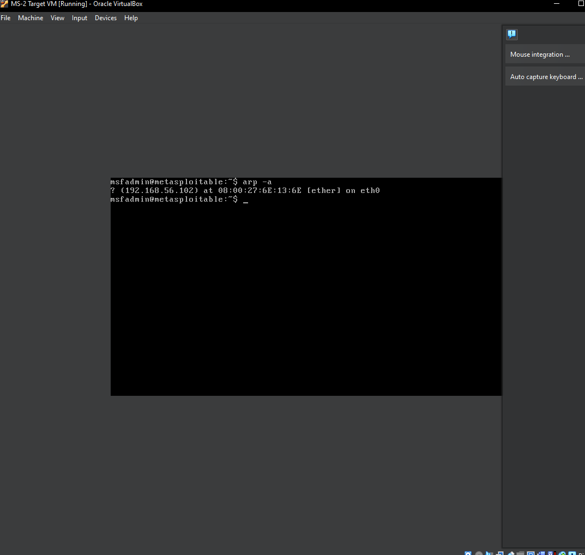

arp -a after spoofing:

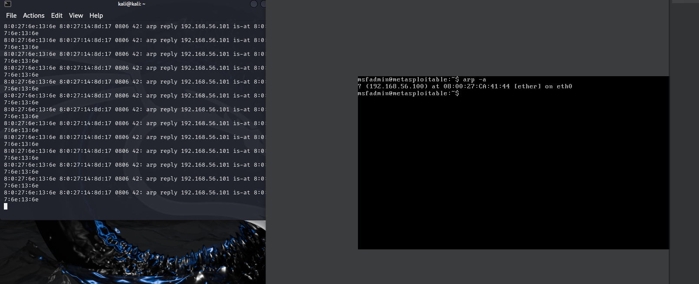

#### **Response to Analysis Questions**    

# ARP Poisoning: Analysis, Implications, and Prevention

## What Does ARP Poisoning Enable Attackers to Do?

**ARP poisoning**, or **ARP spoofing**, allows attackers to manipulate the Address Resolution Protocol (ARP) cache in a network. By associating their own MAC address with the IP address of another device, attackers can intercept, modify, or redirect traffic meant for that device. This can lead to several malicious actions:

- **Man-in-the-Middle (MitM) Attacks**: The attacker can intercept communication between two devices, such as login credentials or sensitive data, without the devices knowing.
- **Denial of Service (DoS)**: By causing network devices to send traffic to incorrect destinations, attackers can disrupt network operations.
- **Session Hijacking**: Attackers can take control of an active session between devices, such as a web session, and potentially inject malicious commands or steal information.

ARP poisoning is particularly dangerous due to the lack of authentication in the ARP protocol, making it easy for any device on the network to claim an IP address.

## How Can ARP Poisoning Be Prevented?

To prevent ARP poisoning, several measures can be taken:

1. **Static ARP Entries**: Manually associating IP addresses with MAC addresses on critical devices makes it difficult for attackers to manipulate the ARP cache.
2. **Dynamic ARP Inspection (DAI)**: This technique validates ARP requests and replies against a trusted database to ensure they come from legitimate sources.
3. **Port Security**: Restricting the number of MAC addresses per port can prevent unauthorized devices from participating in the network.
4. **Encryption**: Encrypting traffic, such as using HTTPS, ensures intercepted data remains unreadable.
5. **ARP Spoofing Detection Tools**: Tools like **XArp** can detect and alert network administrators to suspicious ARP activity.
6. **VLAN Segmentation**: Segmenting network traffic into different VLANs limits the impact of ARP poisoning to specific network segments.

---

## **Attack 2: SYN Flood (With and Without IP Spoofing)**  

### **Deliverables**  

#### **Screenshots**  
CPU intitially: 0

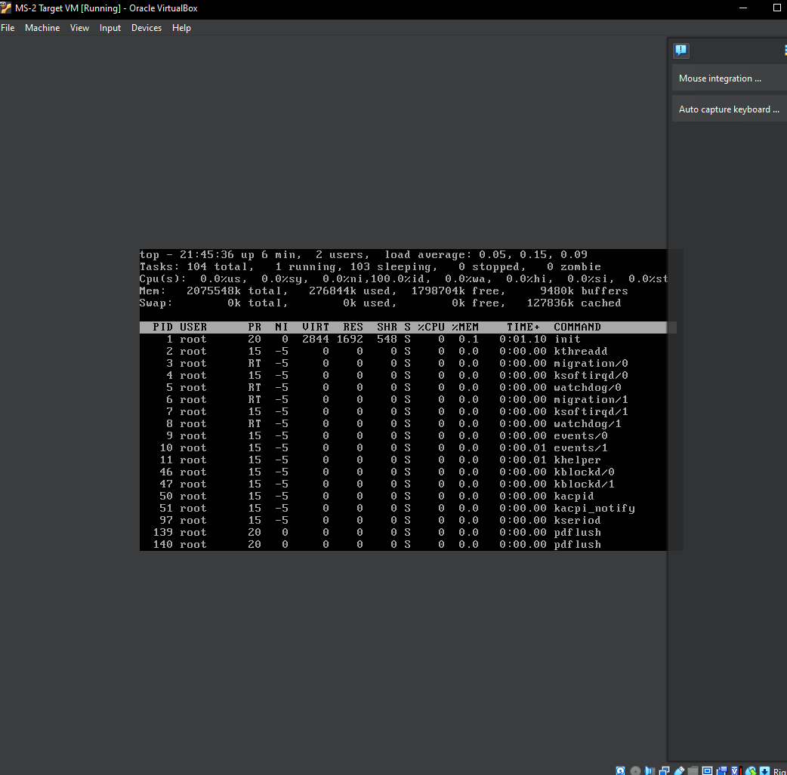

CPU without spoofing: 4+

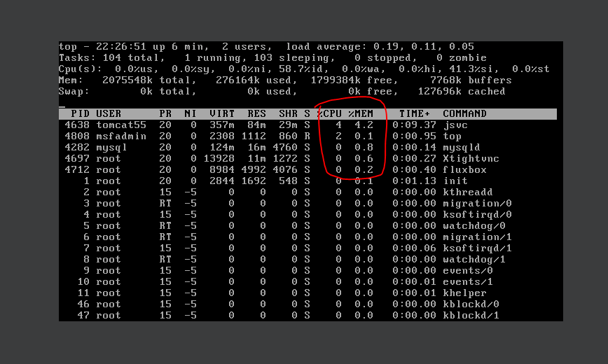

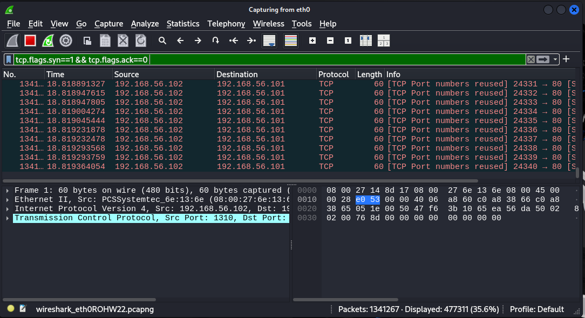

CPU with spoofing: 22

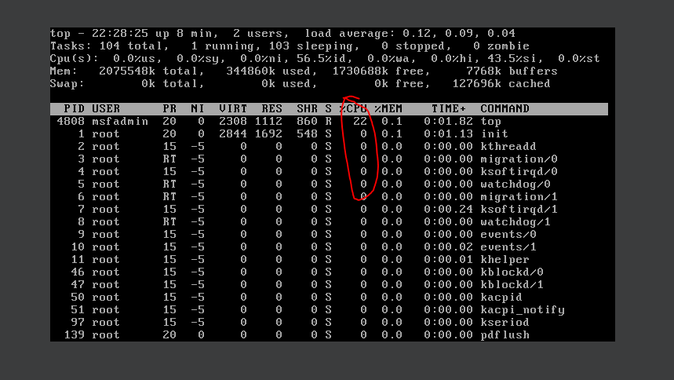

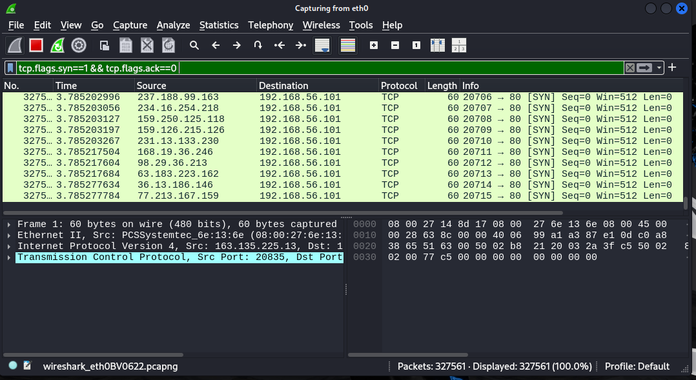

#### **Response to Analysis Questions**     

# IP Spoofing: Detection and Defense Challenges

## How Does the Attack Pattern Differ in Wireshark?

In **Wireshark**, IP spoofing attacks are identified by **unusual packet headers**. The attacker forges the **source IP address**, making it appear as if the packet originates from a trusted device. Key indicators in Wireshark include:

- **Unusual Source IPs**: The source IP address will not match any legitimate devices in the network, which can be easily spotted in the packet's source field.
- **Abnormal Traffic**: Spoofed packets may come from unfamiliar sources or in unusual patterns, deviating from typical network behavior.
- **Failed Responses**: When an attack like DDoS is launched, responses might be sent to nonexistent addresses, which can also be flagged in Wireshark.

## Why Is IP Spoofing Effective for Hiding Attackers and Bypassing Defenses?

IP spoofing is effective for evading detection because it allows the attacker to hide their true identity by forging the source IP address. This tactic enables attackers to:

- **Avoid Tracing**: Spoofed packets make it difficult to trace the source of the attack.
- **Bypass IP Filters**: Firewalls and intrusion detection systems (IDS) that rely on IP filtering are often ineffective because they cannot distinguish between legitimate and spoofed IP addresses.
- **Manipulate Traffic**: Spoofing enables attackers to manipulate the routing of traffic, bypassing security systems that rely on IP-based filtering.

## Which Version of the Attack Would Be Harder to Block with Traditional Firewalls?

**Distributed IP spoofing** or **randomized source addresses** are harder to block with traditional firewalls. These attacks flood the target with traffic from many different, falsified IP addresses, making it impossible for firewalls to filter malicious traffic based on IP alone. Additionally, **protocol-based spoofing** (such as UDP or ICMP) bypasses traditional firewall rules, further complicating defense efforts.

---

## **Attack 3: Exploiting a Vulnerable Service (Remote Code Execution – RCE)**  

### **Deliverables**  

#### **Screenshots**  

Screenshot of Nmap scan showing vulnerable vsftpd service.

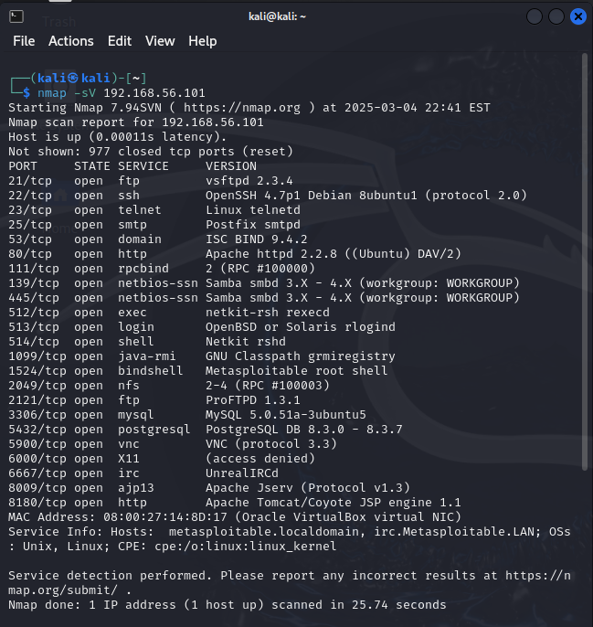

Screenshot of Metasploit successfully exploiting vsftpd.

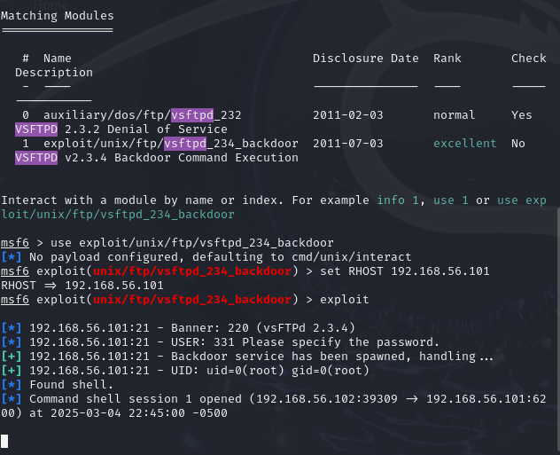

Screenshot of remote shell access (whoami, ls -la /root).

#### **Response to Analysis Questions**

# vsftpd 2.3.4 Vulnerability: Analysis and Prevention

## Why Was the vsftpd 2.3.4 Service Vulnerable?

The **vsftpd 2.3.4** vulnerability was caused by a backdoor embedded in the service, which occurred when the software's FTP username field was manipulated. The issue stemmed from a **malicious modification** of the vsftpd package, likely due to a compromised developer account. When the attacker sent the specific username `:)`, the backdoor was triggered, granting unauthorized access to the server.

## How Did the Exploit Work?

The exploit relied on the FTP service allowing an attacker to log in with the username `:)`. This specific input activated the backdoor, giving the attacker **root privileges** without needing any further authentication. Once access was gained, the attacker could execute commands on the server, potentially leading to **full system compromise** and unauthorized control.

## What Security Measures Could Prevent This Type of Attack?

1. **Regular Software Updates**: Ensuring that software is always up to date, especially when security patches are released, helps prevent known vulnerabilities from being exploited.
2. **Limit Anonymous Access**: Disabling anonymous FTP access reduces the attack surface, preventing unauthorized logins from triggering backdoors.
3. **File Integrity Monitoring**: Tools like file integrity checkers can alert administrators to unauthorized modifications, helping to catch malicious code early.
4. **Stronger Authentication**: Using multi-factor authentication or enforcing stronger password policies for FTP login can provide additional protection against unauthorized access.
5. **Network Segmentation**: Isolating FTP services from critical systems reduces the impact of an exploit, containing potential damage.

By applying these measures, the risk of similar backdoor exploits can be significantly reduced.

---

## **Attack 4: Passive LAN Sniffing & Reconnaissance with Wireshark**  

### **Deliverables**  

#### **Screenshots**  

Screenshot of me inputing my login and password).

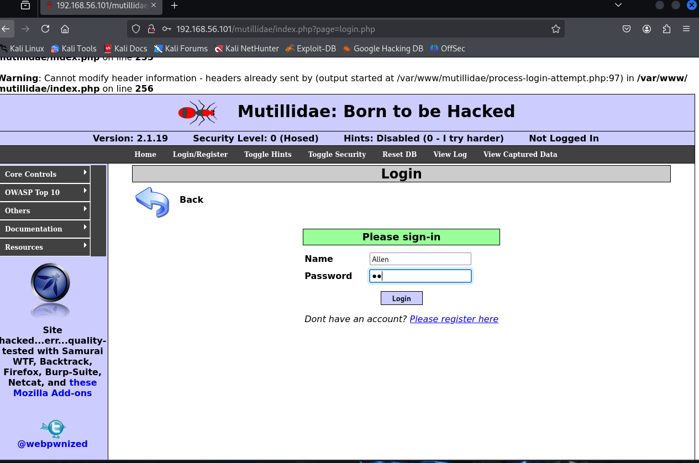

Screenshot of wireshark capturing that eacpt http data, stealing my login:

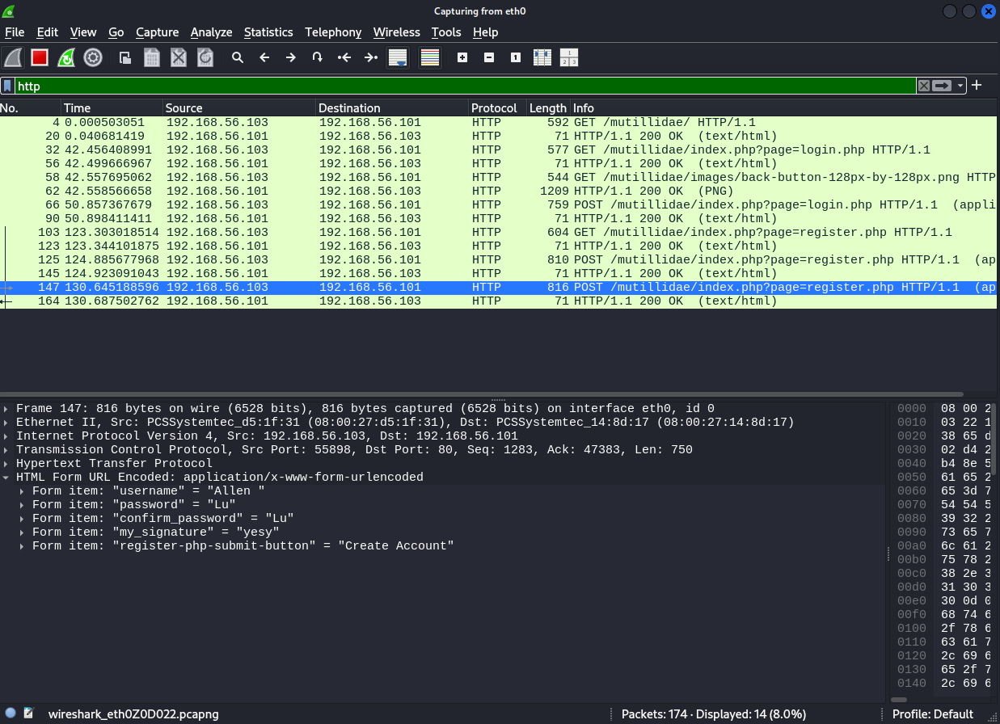

#### **Response to Analysis Questions**   

# Analysis Questions: Passive Sniffing Attack

## What Did the Attacker Observe?

The attacker, using promiscuous mode and Wireshark on the Attacker VM, captured all unencrypted HTTP traffic between the Defense VM and the Metasploitable 2 web server. This traffic may include:

- **HTTP GET and POST requests**: The attacker can observe what URLs are being accessed by the Defense VM, including potential sensitive application routes (e.g., login or profile pages).
- **Plaintext Credentials**: If the Defense VM submits login credentials through an HTTP form, the attacker can capture the **username and password** in plaintext.
- **Session Cookies and Other Sensitive Data**: The attacker may also capture session cookies, authentication tokens, or other sensitive information passed in the HTTP headers or body.

## How Could an Organization Prevent Passive Sniffing?

An organization can implement several measures to prevent passive sniffing attacks:

1. **Use HTTPS (SSL/TLS)**: By ensuring all communications are encrypted using HTTPS, all data, including credentials, session cookies, and other sensitive information, are encrypted, making them unreadable to an attacker monitoring the network.
2. **Network Segmentation**: Isolating sensitive data traffic onto secure, private networks or using VLANs can prevent unauthorized access to network traffic.
3. **Encryption at the Application Layer**: Encrypt sensitive information at the application layer (e.g., using end-to-end encryption in emails or messages) to ensure that even if the network traffic is intercepted, the data remains secure.
4. **Disable Unnecessary Services**: Ensure that unnecessary services or network interfaces (like promiscuous mode) are not enabled by default, reducing the attack surface.

## Why Is HTTPS Important?

**HTTPS** (HyperText Transfer Protocol Secure) is crucial for several reasons:

1. **Encryption**: HTTPS encrypts all data transmitted between the client and server using **SSL/TLS**, ensuring that even if an attacker captures network traffic, the data (including credentials, cookies, etc.) will be unreadable.
2. **Data Integrity**: HTTPS ensures that the data sent between the client and server is not altered or tampered with during transmission. Any changes made to the data during transmission will be detected by the receiving party.
3. **Authentication**: HTTPS also verifies the authenticity of the web server, ensuring the client is connecting to the legitimate server and not an attacker posing as the legitimate server (mitigating man-in-the-middle attacks).

By using HTTPS, organizations protect sensitive information, prevent eavesdropping, and ensure secure communication between clients and servers.

---

